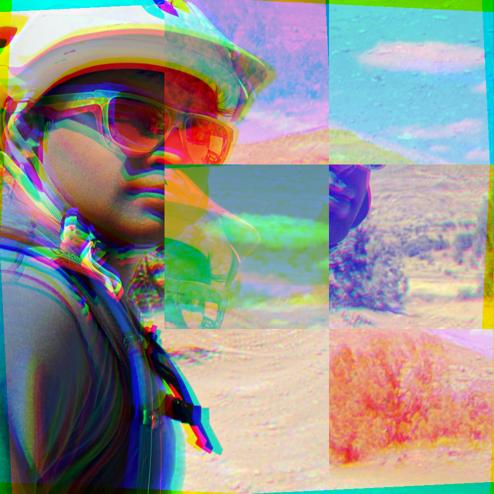

# Patch Swap Filter

An image filter in Julia which randomly swaps patches of an image as it traverses.

## Usage

Load an image and then use

```jl
@doc"""
src_img: Input image loaded from JuliaImage
patch_size: Size of each image patch (px)
swap_prob: Probablity to swap a pair of patches
channel_rotation: How much to rotate the channels of the image in the final image
result_img_size: Size of resulting image. Image will be center cropped square to the specified size
"""

build_img(src_img, patch_size, swap_prob, channel_rotation, result_img_size)
```

## Example



## What the filter does

The filter starts by breaking the image up into patches and assigning each patch an id.

Then filter starts in a corner and with some provided probability, will swap the current patch and the patch next to it on the x axis, then runs the same process on the y axis. This is done progressively for each patch until there is no more.

This patch swapping is done with the ids and then the image is rendered by using the constructed patch map to map patches from the old image to patches in the new image.

This can be done per channel or over the course of the full image through small modifications.